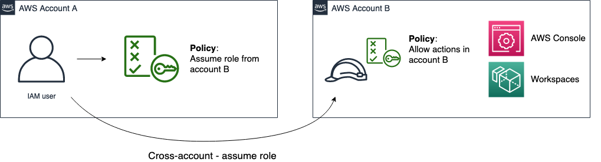

+++
title = "Demo 3 - Cross account access"
date = 2021-02-17T17:04:42-06:00
weight = 3
chapter = false
pre = "<b>3. </b>"
+++

### Description

This demo will demostrate how cross account works with IAM users, you will create the required elements (user, roles, policies)

#### Demo diagram

1. In this Demo you will use two ddifferent AWS accounts. In account A you will create:

    * Cross account IAM user
    * Assume role policy

1. In account B you will create:

    * IAM role and a policy with allow permission with read-only access to the account B console and trst relationship with account A

### Pre-requisites

1. Two AWS accounts (from Isengard)